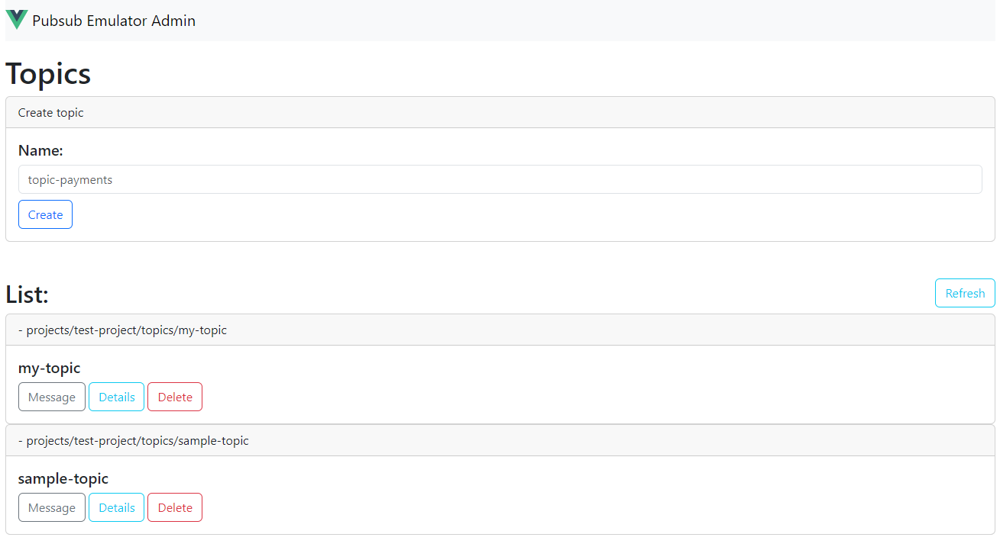

# pubsub-emulator-admin

## Build:
```sh
docker build -t pubsubadmin .
```

## Run
### Pull image:
```sh
docker pull willsbctm/pubsub-emulator-admin
```

### Run container:
```sh
docker run -d -p 8000:8000 -p 8085:80 -p 8432:8432 willsbctm/pubsub-emulator-admin
```

1. Admin portal will be available in: `http://localhost:8085`
2. Pubsub will be available in: `localhost:8432`
3. The Admin portal api will be available in `http://localhost:8000/api`

## Features:

### Topics:
1. Create
2. List
3. Delete



### Details:
1. List subscriptions
2. Delete subscriptions


### Message:
1. Send message to topic

